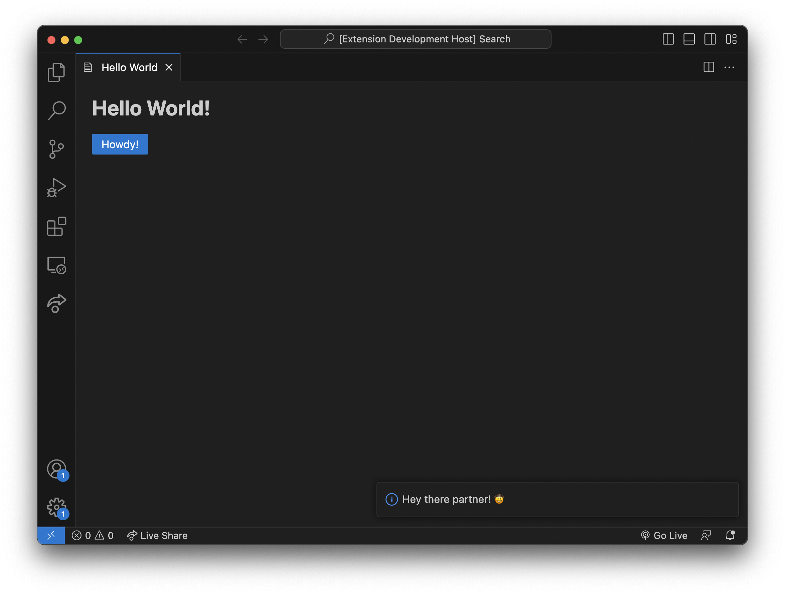

# Hello World (React + Create React App)

This is an implementation of the default [Hello World](https://github.com/microsoft/vscode-webview-ui-toolkit-samples/tree/main/default/hello-world) sample extension that demonstrates how to set up and use a [React](https://reactjs.org/) + [Create React App](https://create-react-app.dev/) + [Webview UI Toolkit](https://github.com/microsoft/vscode-webview-ui-toolkit) webview extension.



## Documentation

For a deeper dive into how this sample works, read the guides below.

- [Extension structure](./docs/extension-structure.md)
- [Extension commands](./docs/extension-commands.md)
- [Extension development cycle](./docs/extension-development-cycle.md)

## Run The Sample

```bash
# Copy sample extension locally
npx degit microsoft/vscode-webview-ui-toolkit-samples/frameworks/hello-world-react-cra hello-world

# Navigate into sample directory
cd hello-world

# Install dependencies for both the extension and webview UI source code
npm run install:all

# Build webview UI source code
npm run build:webview

# Open sample in VS Code
code .
```

Once the sample is open inside VS Code you can run the extension by doing the following:

1. Press `F5` to open a new Extension Development Host window
2. Inside the host window, open the command palette (`Ctrl+Shift+P` or `Cmd+Shift+P` on Mac) and type `Hello World (React + CRA): Show`

# Contributing

## Prerequisites

```sh
cp .env.example .env
```

Then add your OpenAI API key to the .env file

### Recommended

Install the Node version specified in the `.nvmrc` file

```sh
nvm install
```

Switch to that Node version

```sh
nvm use
```

### Optional

Persist the default Node version

```sh
nvm alias default
```

## Install

Install global dependencies

```sh
npm install -g vsce
```

Install local dependencies

```sh
npm install
```

## Build

Build the extension as a VSIX file

```sh
npm run build
```

## Install

Install the extension from the VSIX file

```sh
npm run install:extension
```

Alternatively, you can install the extension it by running the command "Extensions: Install from VSIX..." and selecting the VSIX file.

## Usage

Open the command pallette with `Ctrl+Shift+P` and type `Ignite Hello World` to see the output.
